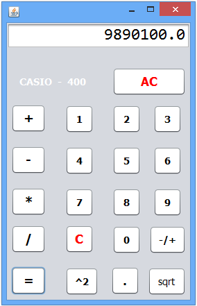

# Калькулятор_001

## В данной статье мы рассмотрим процесс создания простой программы,
### которая состоит из 21 кнопки , и дисплея калькулятора .

✦1) При нажатии цифры текущая цифра добавляется на дисплей .

✦2) При нажатии кнопки "С" удаляется последняя цифра .

✦3) При нажатии кнопки "SE" удаляются все цифры c дисплея .

✦4) При нажатии на операцию введённое число сбрасывается .

✦5) При нажатии на кнопку "-/+" значение меняется на положительное или отрицательное .

✦6) При нажатии на кнопку "sqrt" выполняется соответствующая скрипту функция ,выведения из текущего числа квадратного корня .
             
✦7) При нажатии на кнопку "str^str" выполняется возведение текущего числа в соответствующую степень .			 

✦8) При нажатии на кнопку  "=" выполняется действие и результат выводится на дисплей .

✦9) При желании , можно зафоловить мой аккаунт в https://twitter.com/rodomod .

✦10) Десятичная точка "."   как Вы знаете разделяет целую и дробные части числа .
